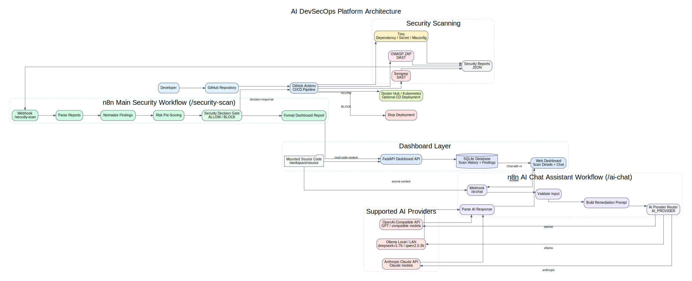
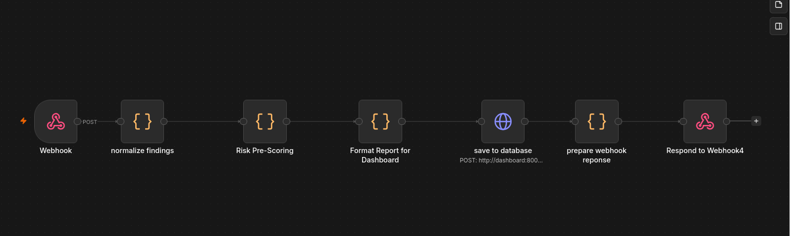
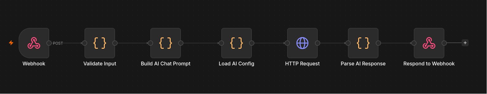
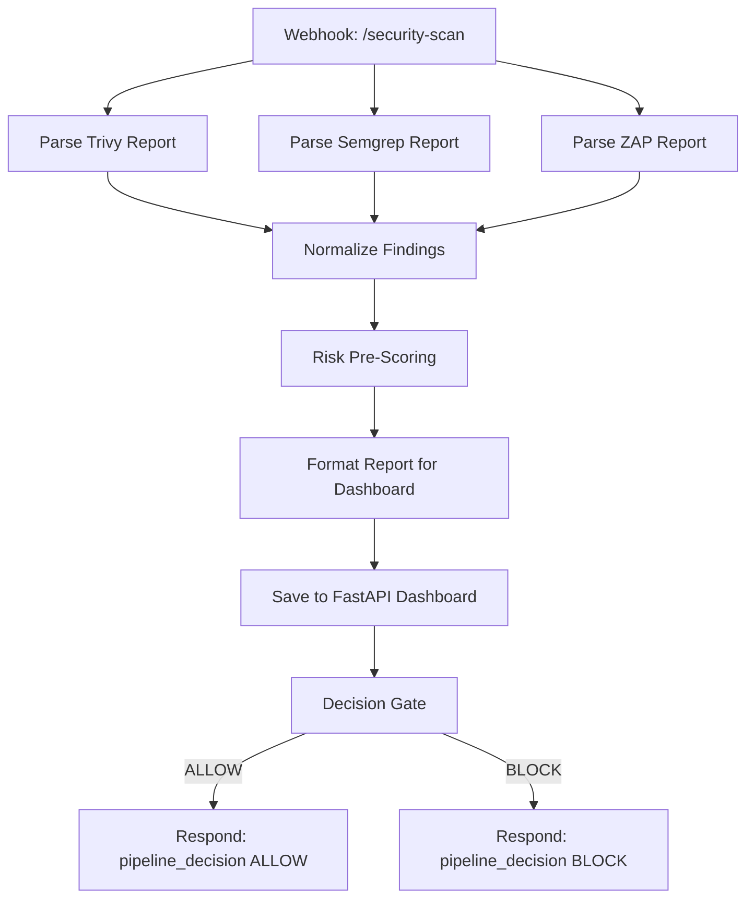
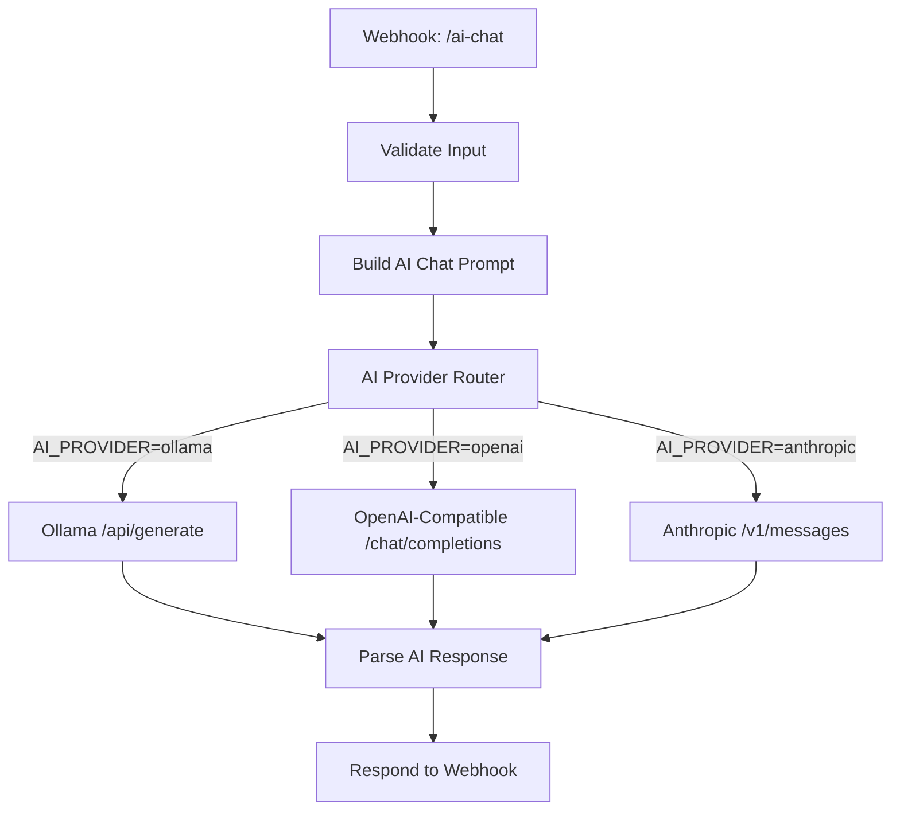
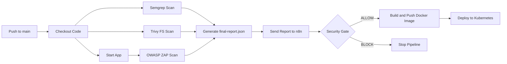
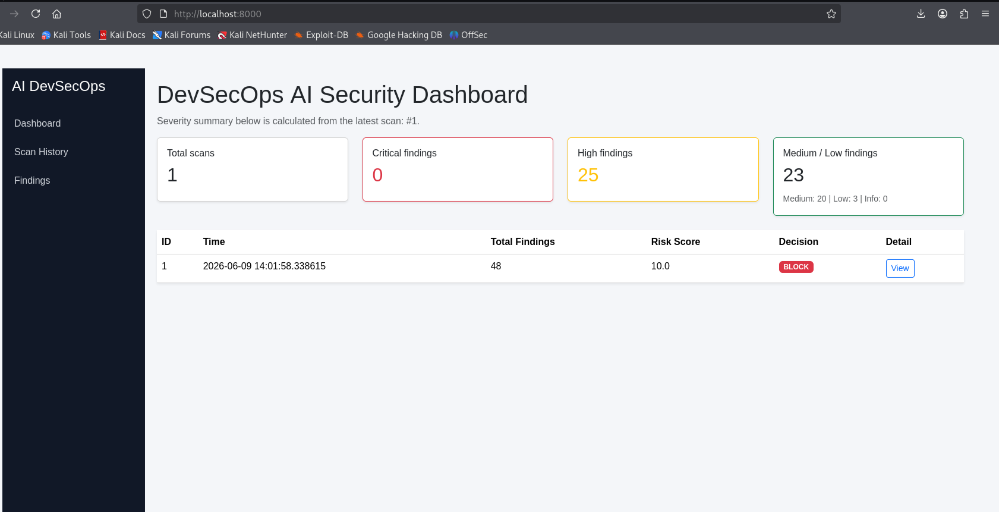

# AI DevSecOps Platform

AI DevSecOps Platform is an open-source security orchestration platform that combines CI/CD security scanning, n8n workflow automation, AI-assisted vulnerability analysis, and a FastAPI dashboard for scan history and remediation support.

The platform is designed for learning, thesis research, and DevSecOps experimentation. It helps developers automatically scan source code and running web applications, collect security reports, calculate risk, decide whether a pipeline should continue, and review results through a local dashboard.

The system supports both local and cloud LLMs:

- **Local AI** with Ollama, for example `deepseek-r1:7b` or `qwen2.5:3b`
- **OpenAI-compatible APIs**, for example OpenAI or other compatible providers
- **Anthropic Claude API**, for Claude-based remediation assistance

---

## Table of Contents

- [Overview](#overview)
- [Key Features](#key-features)
- [Architecture](#architecture)
- [Workflow](#workflow)
- [Technology Stack](#technology-stack)
- [Project Structure](#project-structure)
- [Requirements](#requirements)
- [Quick Start](#quick-start)
- [Environment Variables](#environment-variables)
- [AI Provider Configuration](#ai-provider-configuration)
- [Docker Compose Notes](#docker-compose-notes)
- [n8n Workflow Setup](#n8n-workflow-setup)
- [GitHub Actions Integration](#github-actions-integration)
- [Dashboard](#dashboard)
- [Chat with AI](#chat-with-ai)
- [API Format](#api-format)
- [Security Gate Logic](#security-gate-logic)
- [Source Code Mounting](#source-code-mounting)
- [Troubleshooting](#troubleshooting)
- [Roadmap](#roadmap)
- [Research Positioning](#research-positioning)
- [License](#license)

---

## Overview

This platform connects the following DevSecOps components into one automated workflow:

1. **GitHub Actions** runs security scans after code changes.
2. **Semgrep** performs Static Application Security Testing (SAST).
3. **Trivy** scans dependencies, filesystem content, secrets, and misconfigurations.
4. **OWASP ZAP** performs Dynamic Application Security Testing (DAST) against a running web application.
5. **n8n** receives reports through a webhook, normalizes findings, calculates risk, and controls the security gate.
6. **AI Provider Router** sends prompts to Ollama, OpenAI-compatible APIs, or Anthropic Claude depending on `.env`.
7. **FastAPI Dashboard** stores and displays scan history, findings, AI summaries, and pipeline decisions.
8. **SQLite** stores scan data locally for simple deployment.
9. **Interactive AI Chat** helps developers understand and fix each vulnerability from the dashboard.

---

## Key Features

- Automated CI/CD security scanning
- SAST scanning with Semgrep
- Dependency, secret, and misconfiguration scanning with Trivy
- DAST scanning with OWASP ZAP
- n8n-based vulnerability processing workflow
- Risk scoring and security gate decision
- Local LLM integration through Ollama
- Optional OpenAI-compatible cloud LLM support
- Optional Anthropic Claude support
- Dashboard for scan history and finding details
- Interactive **Chat with AI** for each vulnerability
- SQLite database persistence
- Docker Compose deployment
- Source code mounting for AI-assisted remediation
- Extensible structure for future PostgreSQL, ChatOps, Kubernetes, and GitOps integration

---

## Architecture


---

## Workflow

### Main security scan workflow



### AI chat workflow



---

## Technology Stack

| Component | Technology |
|---|---|
| CI/CD | GitHub Actions |
| SAST | Semgrep |
| Dependency / Secret / Misconfiguration Scan | Trivy |
| DAST | OWASP ZAP |
| Workflow Automation | n8n |
| Local AI | Ollama |
| Cloud AI Option 1 | OpenAI-compatible API |
| Cloud AI Option 2 | Anthropic Claude API |
| Backend | FastAPI |
| Template Engine | Jinja2 |
| ORM | SQLAlchemy |
| Database | SQLite |
| Deployment | Docker, Docker Compose |
| Optional CD | Docker Hub, Kubernetes |

---

## Project Structure

```text
ai-devsecops-platform/
├── dashboard/
│   ├── main.py
│   ├── Dockerfile
│   ├── requirements.txt
│   ├── templates/
│   └── data/
├── n8n/
│   ├── workflows/
│   └── data/
├── github-actions/
│   └── pipeline.yml
├── docs/
├── scripts/
├── sample-reports/
├── docker-compose.yml
├── .env.example
├── README.md
└── LICENSE
```

---

## Requirements

Install the following tools before running the platform:

- Git
- Docker
- Docker Compose
- n8n running through Docker Compose
- Ollama if using local AI
- ngrok or another public tunnel service if GitHub Actions needs to call your local n8n instance

Recommended system:

- Linux VM or Linux host for Docker Compose
- Ollama can run on the host machine or another machine in the same LAN
- At least 4 GB RAM for lightweight testing
- More RAM or GPU is recommended for larger local models

---

## Quick Start

### 1. Clone the repository

```bash
git clone https://github.com/fhaufiwunf/ai-devsecops-platform.git
cd ai-devsecops-platform
```

### 2. Create environment file

```bash
cp .env.example .env
```

### 3. Edit `.env`

For local Ollama on another LAN machine:

```env
- change url folow options ai you chose

- change source code repo:

SOURCE_CODE_PATH=..........

- change url web localhost if you want to scan by ZAP tool:

SCAN_TARGET_URL=http://host.docker.internal:8080
```

If port `5678` is already used, change:

```env
N8N_PORT=5679
N8N_CHAT_WEBHOOK_URL=http://n8n:5678/webhook/ai-chat
```

Note: `N8N_CHAT_WEBHOOK_URL` is the internal Docker service URL from dashboard to n8n. It should usually stay `http://n8n:5678/...` even if the host maps n8n to `5679`.

### 4. Start the platform

```bash
docker compose up -d --build
```
after build you need to 
sudo chown -R 1000:1000 n8n 
sudo chmod -R 755 n8n

### 5. Check running containers

```bash
docker ps
```

Expected containers:

```text
devsecops-dashboard
devsecops-n8n
```

### 6. Access services

| Service | URL |
|---|---|
| Dashboard | `http://localhost:8000` |
| n8n | `http://localhost:5678` |

### 7. Add workflow 
n8n localhost create new workflow and import from file in n8n/workflow


### 8. Install ngrok and build n8n in internet

1, Install the ngrok agent\
2, Add your authtoken\
3, Start an endpoint

```
ngrok http 5678
```

### 9. Add pipeline.yml to run CI/CD
from github-action copy to .github/workflows/devsecops.yml in you repo

### 10. Start push code to scan
---


## AI Provider Configuration

The platform uses `AI_PROVIDER` to decide which LLM backend is used by the AI Chat Assistant workflow.

Supported values:

| `AI_PROVIDER` | Backend | Use case |
|---|---|---|
| `ollama` | Local or LAN Ollama API | Free local testing, privacy-friendly thesis demo |
| `openai` | OpenAI-compatible API | Higher-quality cloud reasoning and faster response |
| `anthropic` | Anthropic Claude API | Claude-based code explanation and remediation |

### Option 1: Local / LAN Ollama

Use this mode if Ollama runs on your host machine or another machine in the same LAN.

```env
AI_PROVIDER=ollama
OLLAMA_BASE_URL=http://192.168.0.101:11434
OLLAMA_MODEL=deepseek-r1:7b
AI_TEMPERATURE=0.2
AI_MAX_TOKENS=700
```

Test Ollama from the host:

```bash
curl http://192.168.0.101:11434/api/tags
```

If Ollama is running on the same Docker host and `host.docker.internal` works:

```env
OLLAMA_BASE_URL=http://host.docker.internal:11434
OLLAMA_MODEL=qwen2.5:3b
```

On Linux, if Ollama only listens on localhost, start it with:

```bash
OLLAMA_HOST=0.0.0.0:11434 ollama serve
```

### Option 2: OpenAI-compatible API

Use this mode for OpenAI or another OpenAI-compatible API provider.

```env
AI_PROVIDER=openai
OPENAI_COMPATIBLE_BASE_URL=https://api.openai.com/v1
OPENAI_COMPATIBLE_API_KEY=your_api_key
OPENAI_COMPATIBLE_MODEL=gpt-4.1-mini
AI_TEMPERATURE=0.2
AI_MAX_TOKENS=700
```
### Option 3: Anthropic Claude API

Use this mode for Claude API.

```env
AI_PROVIDER=anthropic
ANTHROPIC_API_KEY=your_anthropic_api_key
ANTHROPIC_MODEL=claude-3-5-sonnet-latest
AI_TEMPERATURE=0.2
AI_MAX_TOKENS=700
```
---

## Docker Compose Notes

Make sure the `n8n` service receives the AI environment variables from `.env`.

Make sure the `dashboard` service receives `N8N_CHAT_WEBHOOK_URL`:

```yaml
dashboard:
  build: ./dashboard
  container_name: devsecops-dashboard
  ports:
    - "${DASHBOARD_PORT:-8000}:8000"
  volumes:
    - ./dashboard/data:/app/data
    - ${SOURCE_CODE_PATH:-./sample-source}:/workspace/source:ro
  env_file:
    - .env
  environment:
    - N8N_CHAT_WEBHOOK_URL=${N8N_CHAT_WEBHOOK_URL:-http://n8n:5678/webhook/ai-chat}
  depends_on:
    - n8n
  restart: unless-stopped
```

---

## n8n Workflow Setup

The platform uses two workflows.

### 1. Main Security Scan workflow



### 2. AI Chat Assistant workflow



Expected dashboard request to `/ai-chat`:

```json
{
  "finding_id": 1,
  "question": "How do I fix this vulnerability?",
  "finding": {
    "tool": "semgrep",
    "severity": "HIGH",
    "type": "sast",
    "title": "SQL Injection",
    "file_or_url": "src/login.php",
    "line": 27,
    "suggested_fix": "Use parameterized queries."
  },
  "source_context": "Code around the vulnerable line"
}
```

Expected response:

```json
{
  "finding_id": 1,
  "question": "How do I fix this vulnerability?",
  "answer": "AI-generated remediation guidance",
  "provider": "ollama",
  "created_at": "2026-06-09T00:00:00.000Z"
}
```

---

## GitHub Actions Integration

The pipeline template is located at:

```text
github-actions/pipeline.yml
```

To use it in another repository, copy it to:

```text
.github/workflows/devsecops.yml
```

### Required GitHub Secret

| Secret | Purpose |
|---|---|
| `N8N_WEBHOOK_URL` | Public n8n webhook URL that receives scan reports |

Example value:

```text
https://your-ngrok-url.ngrok-free.dev/webhook/security-scan
```

### Optional GitHub Secrets for CD Deployment

The provided pipeline can also support Docker Hub and Kubernetes deployment. If you only want to test security scanning, comment out the Docker Hub and Kubernetes deployment steps.

For full CI/CD deployment, configure these secrets:

| Secret | Purpose |
|---|---|
| `DOCKERHUB_USERNAME` | Docker Hub username |
| `DOCKERHUB_TOKEN` | Docker Hub access token |
| `KUBE_CONFIG` | Base64-encoded Kubernetes config |
| `K8S_NAMESPACE` | Kubernetes namespace |
| `K8S_DEPLOYMENT` | Kubernetes deployment name |
| `K8S_CONTAINER` | Kubernetes container name |

### Pipeline stages



---

## Dashboard

The dashboard provides a local web interface for reviewing scan results.



Main capabilities:

- View scan history
- View pipeline decision: `ALLOW` or `BLOCK`
- View risk score
- View severity summary
- View total findings
- View individual finding details
- View AI-generated summary and fix suggestion
- Start interactive AI chat for each finding
- Store scan data persistently in SQLite

Dashboard URL:

```text
http://localhost:8000
```

SQLite database path:

```text
dashboard/data/devsecops_scans.db
```

---

## Chat with AI

The **Chat with AI** feature lets a developer ask remediation questions for a specific vulnerability.

Example questions:

- How do I fix this vulnerability?
- Why is this vulnerable?
- Show a secure code example.
- How can I verify the fix?
- Does this issue block the pipeline?

Recommended data flow:

```text
Dashboard finding detail
    ↓
Load finding metadata
    ↓
Read source code around vulnerable line from /workspace/source
    ↓
POST to n8n /webhook/ai-chat
    ↓
AI_PROVIDER selects Ollama / OpenAI / Claude
    ↓
Return answer to dashboard
```

The AI prompt should include:

- Tool name: Semgrep, Trivy, or ZAP
- Severity
- Vulnerability title
- File path or URL
- Line number if available
- Scanner recommendation
- Source code context
- Developer question

---

## API Format

n8n saves scan results to the dashboard API.

Endpoint:

```http
POST /api/scans
```

Internal Docker URL:

```text
http://dashboard:8000/api/scans
```

Example payload:

```json
{
  "report_type": "DevSecOps Security Report",
  "total_findings": 3,
  "pipeline_decision": "BLOCK",
  "ai_analyzed_findings": [
    {
      "tool": "semgrep",
      "type": "sast",
      "severity": "HIGH",
      "title": "SQL Injection",
      "file": "src/login.php",
      "line": 27,
      "risk_score": 8.5,
      "ai_summary": "User input is concatenated directly into an SQL query.",
      "ai_fix_suggestion": "Use prepared statements or parameterized queries."
    }
  ],
  "normal_findings_report": [
    {
      "tool": "zap",
      "type": "dast",
      "severity": "MEDIUM",
      "title": "Missing Content Security Policy Header",
      "url": "http://localhost:8080",
      "suggested_fix": "Add a strict Content-Security-Policy header."
    }
  ]
}
```

Expected response:

```json
{
  "status": "saved",
  "scan_id": 1,
  "pipeline_decision": "BLOCK"
}
```

---

## Security Gate Logic

The security gate decides whether the deployment should continue.

Typical blocking conditions:

- At least one `CRITICAL` finding
- At least one high-risk AI-analyzed finding
- Risk score is greater than or equal to the configured threshold
- n8n returns invalid JSON or fails to respond

Example decision response from n8n:

```json
{
  "pipeline_decision": "BLOCK",
  "risk_score": 8.5,
  "summary": "Critical or high-risk vulnerability detected. Deployment should be stopped."
}
```

GitHub Actions reads this response. If the decision is not `ALLOW`, the CD deployment stage is stopped.

---

## Source Code Mounting

The Docker Compose file supports source code mounting:

```yaml
${SOURCE_CODE_PATH:-./sample-source}:/workspace/source:ro
```

Purpose:

- Allow the dashboard or n8n to read vulnerable source code context
- Extract code around vulnerable lines
- Send relevant code snippets to the AI assistant
- Improve fix suggestions

Example:

```env
SOURCE_CODE_PATH=/home/giang123/DVWA
```

Inside the container, the code is available at:

```text
/workspace/source
```

---

## Troubleshooting

### 1. n8n cannot connect to Ollama

Check `.env`:

```env
AI_PROVIDER=ollama
OLLAMA_BASE_URL=http://192.168.0.101:11434
OLLAMA_MODEL=deepseek-r1:7b
```

Verify from the host:

```bash
curl http://192.168.0.101:11434/api/tags
```

Verify from inside the n8n container:

```bash
docker exec -it devsecops-n8n sh
wget -qO- http://192.168.0.101:11434/api/tags
```

If `host.docker.internal` does not resolve on Linux, use your host LAN IP address instead.

---

### 2. n8n cannot read `$env` variables

Set this in `.env`:

```env
N8N_BLOCK_ENV_ACCESS_IN_NODE=false
```

Then restart n8n:

```bash
docker compose restart n8n
```

---

### 3. Dashboard cannot call Chat with AI

Check the dashboard `.env` value:

```env
N8N_CHAT_WEBHOOK_URL=http://n8n:5678/webhook/ai-chat
```

Then check from inside the dashboard container:

```bash
docker exec -it devsecops-dashboard sh
wget -qO- http://n8n:5678/webhook/ai-chat
```

For a POST test:

```bash
curl -X POST http://localhost:5678/webhook/ai-chat \
  -H "Content-Type: application/json" \
  -d '{"finding_id":1,"question":"How do I fix this?","finding":{"title":"SQL Injection","severity":"HIGH"},"source_context":"$id = $_GET[\"id\"];"}'
```

---

### 4. GitHub Actions cannot reach n8n

If n8n is running locally, GitHub Actions cannot call `localhost` on your machine. Use ngrok or another tunnel.

Example:

```bash
ngrok http 5678
```

Then set GitHub secret:

```text
N8N_WEBHOOK_URL=https://your-ngrok-url.ngrok-free.dev/webhook/security-scan
```

---

### 5. Dashboard does not show new scan results

Check dashboard logs:

```bash
docker logs devsecops-dashboard
```

Check n8n logs:

```bash
docker logs devsecops-n8n
```

Check if the dashboard API is reachable from n8n:

```bash
docker exec -it devsecops-n8n sh
wget -qO- http://dashboard:8000
```

---

### 6. ZAP report is empty

ZAP requires a running web application.

Check `SCAN_TARGET_URL` or `APP_URL` in the GitHub Actions workflow:

```env
SCAN_TARGET_URL=http://host.docker.internal:8080
```

If the app is not reachable, ZAP will not be able to crawl or scan it.

---

### 7. Docker Hub or Kubernetes deployment fails

If you are only testing the security pipeline, comment out these stages:

- Login to Docker Hub
- Build Docker Image
- Push Docker Image
- Setup kubeconfig
- Deploy to Kubernetes

If you want full deployment, configure all required Docker Hub and Kubernetes secrets.

---

## Roadmap

Planned improvements:

- Persistent chat history
- Risk trend graphs
- Top vulnerable files dashboard
- Commit and branch tracking
- Multi-project support
- PDF report export
- PostgreSQL support
- AI-generated code patches
- GitHub PR comments
- Policy-as-code security gate using OPA
- Kubernetes deployment
- GitOps integration
- ChatOps integration with Slack or Telegram

---

## Research Positioning

This project can be positioned as:

> An AI-powered DevSecOps orchestration platform that combines automated vulnerability detection, workflow-based risk analysis, and AI-assisted remediation in a CI/CD environment.

Possible thesis title:

```text
AI-Powered DevSecOps Orchestration Platform for Automated Vulnerability Analysis and Remediation Support
```

Alternative titles:

```text
LLM-Assisted Vulnerability Management Platform
Open Source AI Security Orchestration Framework
AI-Assisted DevSecOps Pipeline for Vulnerability Detection and Remediation
```

---

## License

This project is licensed under the MIT License. See the `LICENSE` file for details.
